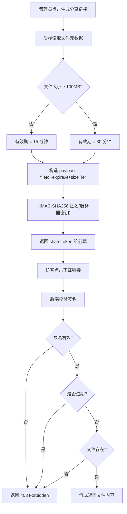

# 企业级多模态文档管理与分享系统 - 产品需求文档（PRD）

## 1. 产品概述

本系统是一套面向企业的多模态文档管理与安全分享平台，提供管理后台与公开网页两套视图。核心解决企业内部文档统一存储、元数据治理、格式化展示，以及对外安全分享（限时下载链接）的问题，目标用户为企业管理员与外部访客。

- **核心价值**：统一文档资产治理 + 安全限时分享，防止链接被恶意篡改与长期盗用。
- **差异化亮点**：基于 HMAC 签名的动态安全下载策略（普通文件 15 分钟、大文件 30 分钟），过期即失效。

## 2. 核心功能

### 2.1 用户角色

| 角色 | 进入方式 | 核心权限 |
|------|----------|----------|
| 管理员 | 账号密码登录管理后台 | 文件上传/编辑/重命名/删除/生成分享链接 |
| 访客 | 直接访问公开网页 | 浏览公开文件、在线预览、通过分享链接下载 |

### 2.2 功能模块

1. **管理后台（Admin Dashboard）**
   - 文件上传与管理：单文件/多文件拖拽上传，大文件分片上传
   - 文件资料编辑：标题、标签、描述、分类的在线编辑与保存
   - 文件重命名：同名冲突检测，同步更新底层存储
   - 文件列表：列表视图 + 网格预览墙，按格式/时间/标签筛选检索

2. **公开网页前端（Public Web）**
   - 文件展示：卡片/列表形式展示公开文件
   - 格式分类显示：按后缀自动匹配图标（PDF/Word/图片/TXT 等）
   - 在线预览：TXT/Markdown/JSON 纯文本网页预览，图片灯箱预览

3. **安全分享与下载机制（核心亮点）**
   - 分享链接生成：每个文件生成独立分享链接
   - 动态安全下载：普通文件 15 分钟有效、大文件 30 分钟有效，不限次数
   - 安全校验：过期返回 403 Forbidden，签名校验在后端完成

### 2.3 页面详情

| 页面名称 | 模块名称 | 功能描述 |
|----------|----------|----------|
| 管理后台-登录 | 登录表单 | 管理员账号密码登录，JWT 鉴权 |
| 管理后台-文件列表 | 列表/网格切换 | 文件展示、筛选检索、批量操作入口 |
| 管理后台-上传 | 拖拽上传区 | 单/多文件拖拽上传，分片上传进度 |
| 管理后台-编辑 | 元数据编辑表单 | 标题/标签/描述/分类编辑保存 |
| 管理后台-重命名 | 重命名弹窗 | 同名冲突检测，实时校验 |
| 公开网页-首页 | 文件卡片墙 | 公开文件展示，格式图标，筛选 |
| 公开网页-预览 | 文本/图片预览 | 纯文本在线预览，图片灯箱 |
| 公开网页-下载 | 分享链接页 | 展示分享链接，点击触发限时下载 |

## 3. 核心流程

### 3.1 安全分享与下载流程（核心）

1. 管理员在后台对某文件点击「生成分享链接」。
2. 后端根据文件大小判定有效期（普通文件 <100MB → 15 分钟；大文件 ≥100MB → 30 分钟）。
3. 后端构造 payload（fileId + expireAt + sizeTier），使用服务器密钥以 HMAC-SHA256 生成签名。
4. 返回 `shareToken = base64url(payload).base64url(signature)`，前端拼接成分享 URL。
5. 访客点击下载链接，后端校验签名 → 校验过期 → 校验文件存在 → 流式返回文件。
6. 过期或签名错误 → 返回 403 Forbidden。

### 3.2 流程图

## 4. 用户界面设计

### 4.1 设计风格

- **主色调**：深空蓝（#0B1220）背景 + 青柠绿（#A3E635）强调色，营造企业级专业感与科技感。
- **次色调**：石墨灰（#1E293B）卡片背景 + 雾白（#E2E8F0）文字。
- **按钮风格**：圆角矩形（rounded-lg），主按钮实色填充，次按钮描边。
- **字体**：标题用 `Space Grotesk`（显示字体），正文用 `IBM Plex Sans`（中文回退到系统无衬线）。
- **布局风格**：管理后台采用左侧导航 + 顶部栏 + 主内容区；公开网页采用顶部导航 + 卡片网格。
- **图标风格**：线性 SVG 图标，文件格式图标按后缀着色（PDF 红、Word 蓝、图片紫、TXT 灰）。

### 4.2 页面设计概览

| 页面名称 | 模块名称 | UI 元素 |
|----------|----------|----------|
| 管理后台-文件列表 | 列表/网格切换 | 顶部工具栏、筛选器、文件表格/卡片墙、分页 |
| 管理后台-上传 | 拖拽上传区 | 虚线边框拖拽区、进度条、文件队列 |
| 公开网页-首页 | 文件卡片墙 | 响应式网格卡片、格式图标、悬浮预览按钮 |
| 公开网页-预览 | 文本/图片预览 | 全屏模态、Markdown 渲染、图片灯箱 |

### 4.3 响应式

- 桌面优先设计，管理后台在 ≥1280px 显示完整三栏布局。
- 平板（768-1280px）折叠侧边栏为图标模式。
- 移动端（<768px）公开网页卡片网格自适应为单列，管理后台提示建议使用桌面端。

## 5. 非功能性需求

- **安全性**：防路径遍历、防恶意文件上传（白名单 + MIME 校验 + 魔数校验）、分享链接签名防篡改。
- **扩展性**：文件存储层抽象 `StorageProvider` 接口，预留对象存储（OSS/S3）实现。
- **性能**：大文件分片上传（每片 5MB），下载流式响应避免内存占用。
- **可维护性**：统一 JSON 响应格式、分层架构（Controller-Service-Repository）。
