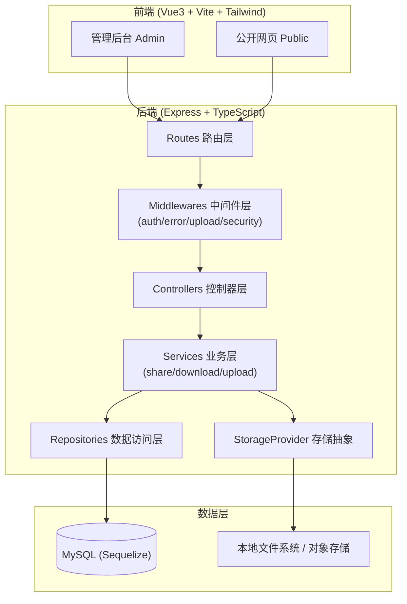
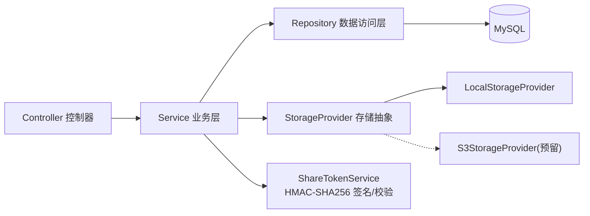
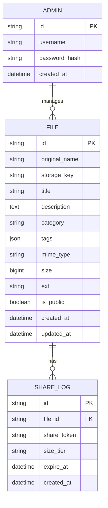

# 企业级多模态文档管理与分享系统 - 技术架构文档

## 1. 架构设计

系统采用前后端分离 + 分层后端架构。前端为 Vue3 SPA（管理后台与公开网页同源不同路由），后端为 Express + TypeScript RESTful API，数据库为 MySQL（Sequelize ORM），文件存储抽象为 `StorageProvider` 接口（本地实现 + 预留对象存储）。



## 2. 技术说明

- **前端**：Vue@3 + vite + tailwindcss@3 + vue-router@4 + pinia + axios
  - 选择 Vue3 而非 React 的理由：Composition API 对文件上传/预览等副作用逻辑组织更清晰；中文社区生态成熟；管理后台场景下模板语法更直观。
- **初始化工具**：vite-init（`npm create vite@latest`）
- **后端**：Express@4 + TypeScript + sequelize@6 + mysql2 + jsonwebtoken + multer + bcryptjs
- **数据库**：MySQL 8.0
- **文件存储**：本地存储（`storage/` 目录），抽象 `IStorageProvider` 接口，预留 `S3StorageProvider` / `OssStorageProvider` 实现

## 3. 路由定义

### 3.1 前端路由

| 路由 | 用途 |
|------|------|
| `/` | 公开网页首页（文件卡片墙） |
| `/preview/:fileId` | 公开网页在线预览（文本/图片） |
| `/s/:shareToken` | 分享链接下载页 |
| `/admin/login` | 管理后台登录 |
| `/admin/files` | 管理后台文件列表 |
| `/admin/upload` | 管理后台上传 |
| `/admin/edit/:fileId` | 管理后台元数据编辑 |

### 3.2 后端 API 路由

| 方法 | 路由 | 用途 | 鉴权 |
|------|------|------|------|
| POST | `/api/auth/login` | 管理员登录 | 否 |
| GET | `/api/files` | 文件列表（支持筛选） | 公开（仅 isPublic） |
| GET | `/api/files/:id` | 文件详情 | 公开（仅 isPublic） |
| GET | `/api/files/:id/preview` | 在线预览内容 | 公开（仅 isPublic） |
| POST | `/api/admin/files` | 上传文件（分片） | 管理员 |
| PUT | `/api/admin/files/:id` | 编辑元数据 | 管理员 |
| POST | `/api/admin/files/:id/rename` | 重命名 | 管理员 |
| DELETE | `/api/admin/files/:id` | 删除文件 | 管理员 |
| POST | `/api/admin/files/:id/share` | 生成分享链接 | 管理员 |
| GET | `/api/share/:token/download` | 安全下载 | 签名校验 |

## 4. API 定义

### 4.1 统一响应格式

```typescript
// 统一响应结构
interface ApiResponse<T = unknown> {
  code: number;        // 业务码：0 成功，非 0 失败
  message: string;     // 提示信息
  data: T | null;      // 业务数据
}
```

### 4.2 核心类型定义

```typescript
// 文件实体
interface FileEntity {
  id: string;
  originalName: string;     // 原始文件名
  storageKey: string;       // 存储键（防遍历，非用户可见路径）
  title: string;            // 标题
  description: string;      // 描述
  category: string;         // 分类
  tags: string[];           // 标签
  mimeType: string;
  size: number;             // 字节
  ext: string;              // 扩展名（小写，不含点）
  isPublic: boolean;
  createdAt: string;
  updatedAt: string;
}

// 分享链接生成响应
interface ShareTokenResponse {
  shareToken: string;       // base64url(payload).base64url(signature)
  downloadUrl: string;      // 拼接好的下载 URL
  expireAt: number;         // 过期时间戳（ms）
  sizeTier: 'normal' | 'large';
}

// 分享 payload（签名前）
interface SharePayload {
  fileId: string;
  expireAt: number;         // 过期时间戳（ms）
  sizeTier: 'normal' | 'large';
  nonce: string;            // 随机串，防重放
}
```

## 5. 服务端架构图



### 5.1 安全下载链接生成与校验逻辑（核心）

**生成阶段（`ShareTokenService.generate`）：**

1. 读取文件元数据，根据 `size` 判定 `sizeTier`：
   - `size < 100 * 1024 * 1024`（100MB）→ `normal`，有效期 15 分钟
   - `size >= 100MB` → `large`，有效期 30 分钟
2. 构造 `payload = { fileId, expireAt: now + ttl, sizeTier, nonce: randomUUID() }`
3. `payloadStr = base64url(JSON.stringify(payload))`
4. `signature = HMAC-SHA256(serverSecret, payloadStr)` → `base64url`
5. `shareToken = payloadStr + '.' + signature`
6. 返回 `{ shareToken, downloadUrl, expireAt, sizeTier }`

**校验阶段（`ShareTokenService.verify`）：**

1. 拆分 `shareToken` 为 `payloadStr` 与 `signature` 两段。
2. 重新计算 `expectedSig = HMAC-SHA256(serverSecret, payloadStr)`，**恒定时间比较**防时序攻击。
3. 签名不匹配 → 抛 403。
4. 解析 payload，`expireAt < now` → 抛 403（已过期）。
5. 查询文件是否存在 → 不存在抛 403。
6. 通过 → 返回 payload，由控制器流式返回文件。

**安全要点：**
- 签名密钥仅存后端环境变量，前端无法伪造。
- payload 含 `nonce` 但不存储（无状态校验），如需防重放可加 Redis 记录已用 nonce。
- 下载时文件路径由数据库 `storageKey` 决定，**绝不使用客户端传入路径**，杜绝路径遍历。

## 6. 数据模型

### 6.1 数据模型定义



### 6.2 数据定义语言（DDL）

```sql
-- 管理员表
CREATE TABLE `admin` (
  `id` VARCHAR(36) NOT NULL,
  `username` VARCHAR(64) NOT NULL,
  `password_hash` VARCHAR(255) NOT NULL,
  `created_at` DATETIME NOT NULL DEFAULT CURRENT_TIMESTAMP,
  PRIMARY KEY (`id`),
  UNIQUE KEY `uk_username` (`username`)
) ENGINE=InnoDB DEFAULT CHARSET=utf8mb4;

-- 文件表
CREATE TABLE `file` (
  `id` VARCHAR(36) NOT NULL,
  `original_name` VARCHAR(255) NOT NULL,
  `storage_key` VARCHAR(255) NOT NULL,
  `title` VARCHAR(255) NOT NULL,
  `description` TEXT NULL,
  `category` VARCHAR(64) NOT NULL DEFAULT 'uncategorized',
  `tags` JSON NULL,
  `mime_type` VARCHAR(128) NOT NULL,
  `size` BIGINT UNSIGNED NOT NULL,
  `ext` VARCHAR(16) NOT NULL,
  `is_public` TINYINT(1) NOT NULL DEFAULT 1,
  `created_at` DATETIME NOT NULL DEFAULT CURRENT_TIMESTAMP,
  `updated_at` DATETIME NOT NULL DEFAULT CURRENT_TIMESTAMP ON UPDATE CURRENT_TIMESTAMP,
  PRIMARY KEY (`id`),
  KEY `idx_ext` (`ext`),
  KEY `idx_category` (`category`),
  KEY `idx_created_at` (`created_at`),
  KEY `idx_is_public` (`is_public`)
) ENGINE=InnoDB DEFAULT CHARSET=utf8mb4;

-- 分享日志表（记录生成的分享链接，便于审计）
CREATE TABLE `share_log` (
  `id` VARCHAR(36) NOT NULL,
  `file_id` VARCHAR(36) NOT NULL,
  `share_token` VARCHAR(512) NOT NULL,
  `size_tier` VARCHAR(16) NOT NULL,
  `expire_at` DATETIME NOT NULL,
  `created_at` DATETIME NOT NULL DEFAULT CURRENT_TIMESTAMP,
  PRIMARY KEY (`id`),
  KEY `idx_file_id` (`file_id`),
  KEY `idx_expire_at` (`expire_at`),
  CONSTRAINT `fk_share_file` FOREIGN KEY (`file_id`) REFERENCES `file` (`id`) ON DELETE CASCADE
) ENGINE=InnoDB DEFAULT CHARSET=utf8mb4;

-- 初始管理员（密码: admin123，bcrypt hash）
INSERT INTO `admin` (`id`, `username`, `password_hash`)
VALUES ('00000000-0000-0000-0000-000000000001', 'admin', '$2a$10$N9qo8uLOickgx2ZMRZoMy.MrqK3u8mQ5v6n5d8mJ8mJ8mJ8mJ8mJ8');
```

## 7. 目录结构

```
/workspace
├── .trae/documents/              # PRD 与技术文档
├── server/                       # 后端
│   ├── src/
│   │   ├── config/              # 配置加载
│   │   ├── models/              # Sequelize 模型
│   │   ├── controllers/         # 控制器
│   │   ├── services/            # 业务逻辑（含 ShareTokenService）
│   │   ├── repositories/        # 数据访问层
│   │   ├── routes/              # 路由定义
│   │   ├── middlewares/         # 中间件（auth/error/upload/security）
│   │   ├── storage/             # 存储抽象（IStorageProvider + Local 实现）
│   │   ├── utils/               # 工具（logger/response/fileType 等）
│   │   ├── types/               # 类型定义
│   │   └── app.ts               # 应用入口
│   ├── storage/                 # 文件存储根目录（运行时生成）
│   ├── package.json
│   ├── tsconfig.json
│   └── .env.example
├── web/                          # 前端
│   ├── src/
│   │   ├── admin/               # 管理后台页面
│   │   ├── public/              # 公开网页页面
│   │   ├── components/          # 共享组件
│   │   ├── api/                 # axios 封装
│   │   ├── stores/              # pinia
│   │   ├── router/              # 路由
│   │   └── main.ts
│   ├── package.json
│   └── vite.config.ts
├── database/
│   └── schema.sql               # 数据库脚本
└── README.md
```
